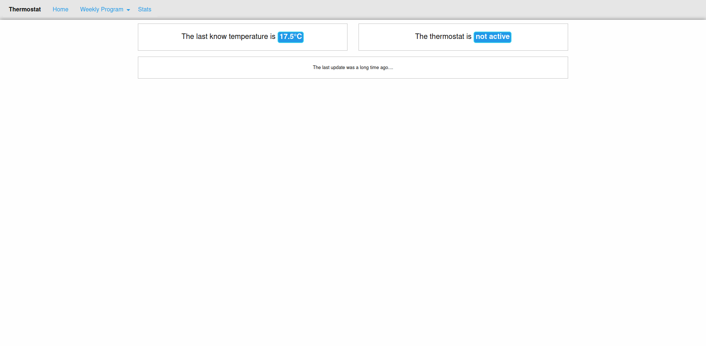

# Raspberry Pi Thermostat interface

A responsive web interface for controlling a Raspberry Pi thermostat.

## Idea
This is based on project I did back when I was in university: creating a smart thermostat that could be controlled both with a web interface and through manual controls.

The original implementation was in PHP (web interface) and C# (micro-controller) and I wasn't quite happy about it and, on top of that, it was based on a custom micro-controller which was quite expensive (but provided by the university :P ).

I decided then to reimplement what I did in PHP with Python and a Raspberry Pi.

## Requirements

**Hardware**
  - A raspberry Pi
  - A thermistor to detect the temperature
  - Buttons*
  - A monochromatic display*

\* *Only if you want physical controls*

**Software**

  - Python 3
  - pip

Once you have `pip`, the other requirements can be installed with `pip install -r requirements.txt`

## Starting up
The web interface can be started by launching `python3 run.py` and is reachable at port 8080. Here's how it should look:

**Homepage**

**Control temperature**

## Inside the code
### Overview
The web interface is based on Python and [web.py](https://webpy.org/) micro-framework. Code for the different pages is at `routes/`

Pages are created with `Jinja2` templating engine. All pages are responsive and built with [Zurb Foundation](https://get.foundation/) CSS Framework. There is some Javascript (jQuery) to sweeten the user experience. They are in `templates/` folder.

Data is saved using a `sqlite` db. A sample database is already provided (`thermostat.db`), but one can be created with `createDB.py`.

The temperature reading and control is inside `Thermostat.py`

### Status

  - The web interface is mostly OK. I wanted to implement a route (`/stats`) to display some historical data on graphs.
  - The temperature reading should be ok if using the thermistor. Since I am not on a budget anymore, I would buy a proper temperature sensor.
  - Setting the temperature with physical controls needs to be implemented
  - Dispaying the current temperature needs to be implemented. If you do that, you need a display to wire up on the RPi.
